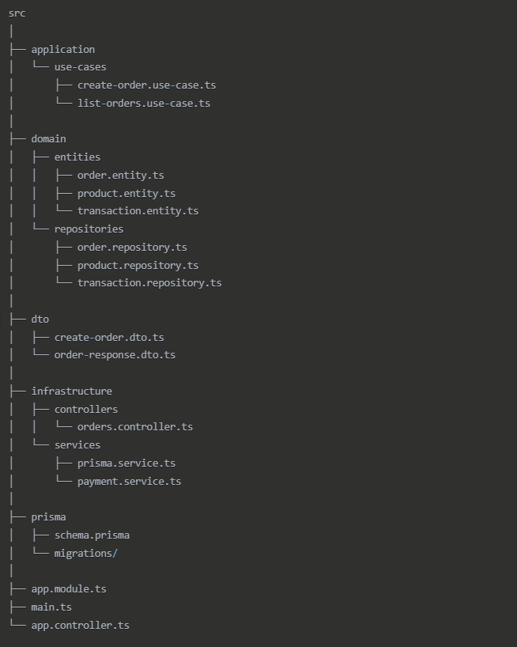

# 🛒 Sistema de Pedidos con NestJS y Prisma

Este proyecto es una API RESTful construida con [NestJS](https://nestjs.com/), que permite gestionar pedidos, productos y pagos de forma estructurada utilizando principios de **arquitectura limpia** y **DDD (Domain-Driven Design)**.

## 🚀 Descripción

La finalidad de este sistema es permitir la creación y gestión de **pedidos de productos**, integrando funcionalidades como:

- Creación y validación de productos.
- Gestión de pedidos y sus ítems asociados.
- Integración con una **pasarela de pagos** para registrar transacciones.
- Arquitectura modular basada en **casos de uso**, **entidades de dominio**, **DTOs**, y una capa de infraestructura desacoplada.

---

## 🧱 Arquitectura del Proyecto

El proyecto sigue una arquitectura limpia inspirada en los principios de Robert C. Martin ("Uncle Bob"):




1. Dominio (Domain)

Entidades: Definen los objetos centrales del negocio como Order, Product y Transaction.
Repositorios: Interfaces que definen métodos para acceder y manipular las entidades.

2. Aplicación (Application)

Casos de Uso: Implementan la lógica de negocio específica como crear pedidos (create-order.use-case.ts) y listar pedidos (list-orders.use-case.ts).

3. Infraestructura (Infrastructure)

Controladores: Manejan las solicitudes HTTP y delegan al caso de uso correspondiente.
Servicios: Implementaciones concretas que interactúan con servicios externos o bases de datos.

prisma.service.ts: Servicio para la conexión con la base de datos.
payment.service.ts: Integración con la pasarela de pagos.


4. DTOs (Data Transfer Objects)

Objetos para transferir datos entre capas, como create-order.dto.ts para recibir datos de creación de orden y order-response.dto.ts para respuestas.

Módulos Principales
Módulo de Productos
Gestiona el catálogo de productos disponibles para compra.
Módulo de Órdenes
Permite la creación y gestión de pedidos con sus respectivos items.
Módulo de Transacciones
Maneja las transacciones financieras asociadas a los pedidos y la integración con la pasarela de pagos.
Características Técnicas
Validaciones

Implementa validaciones de datos en DTOs para garantizar la integridad de la información.
Validaciones de negocio en los casos de uso.

## Base de Datos

Utiliza Prisma ORM para la conexión con la base de datos.
Incluye migraciones para control de versiones de la base de datos.

## Documentación API

Integración con Swagger para documentar los endpoints disponibles.
Accesible a través de la ruta /api.

## Infraestructura

Configuración de CORS para permitir solicitudes de diferentes orígenes.
Configuración flexible del puerto mediante variables de entorno.


## 🧾 Modelo de Datos (Prisma)

El esquema Prisma define los modelos principales del sistema:

```ts
model Product {
  id          String   @id @default(uuid())
  name        String
  description String
  price       Float
  category    String
  brand       String
  images      String[]
  stock       Int
  discount    Float     @default(0)
  code        String   @unique
  salesCount  Int       @default(0)
  status      ProductStatus
  orderItems  OrderItem[]
  createdAt   DateTime  @default(now())
  updatedAt   DateTime  @updatedAt
}

enum ProductStatus {
  active
  inactive
  archived
}

model Order {
  id          String       @id @default(uuid())
  userId      String
  totalAmount Float
  status      OrderStatus
  createdAt   DateTime     @default(now())
  updatedAt   DateTime     @updatedAt
  items       OrderItem[]
  transaction Transaction?

  @@map("orders")
}

enum OrderStatus {
  active
  inactive
  archived
}

model OrderItem {
  id        String   @id @default(uuid())
  orderId   String
  productId String
  quantity  Int
  unitPrice Float

  product   Product  @relation(fields: [productId], references: [id])
  order     Order    @relation(fields: [orderId], references: [id])

  @@map("order_items")
}

model Transaction {
  id                      String   @id @default(uuid())
  orderId                 String   @unique
  amount                  Float
  discount                Float    @default(0)
  fee                     Float
  method                  PaymentMethod
  status                  TransactionStatus
  createdAt               DateTime @default(now())

  deliveryName            String
  deliveryPhone           String
  deliveryCity            String
  deliveryAddress         String

  customerName            String
  customerIdentification  String
  customerEmail           String
  currency                String
  paymentSourceId         String
  description             String?

  order                   Order    @relation(fields: [orderId], references: [id])

  @@map("transactions")
}

enum PaymentMethod {
  credit_card
}

enum TransactionStatus {
  pending
  completed
  failed
}


# Clona el repositorio
git clone https://github.com/tuusuario/mi-app-nest-pedidos.git
cd mi-app-nest-pedidos

# Instala las dependencias
npm install

# Configura la base de datos
cp .env.example .env
# Asegúrate de actualizar la variable DATABASE_URL

# Genera el cliente de Prisma
npx prisma generate

# Ejecuta las migraciones
npx prisma migrate dev

# Inicia la aplicación en desarrollo
npm run start:dev

🧠 Tecnologías Utilizadas
NestJS (framework Node.js)

Prisma ORM

PostgreSQL

TypeScript

Arquitectura limpia (Clean Architecture)

Swagger (Documentación)

Jest (Testing)